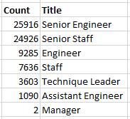
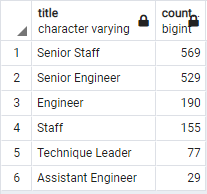

# pewlett-hackard-analysis
Analysis of Hewlett Packard HR data to determine how many positions will need to be filled after mass retirement

## Overview of Project

### Purpose

* Determine how many positions will need to be filled after mass retirement

* Babyboomers retiring quickly, preparing for shift

* Bobby is trying to determine who will be retiring in the next few years and how many positions are needing refilled

* Future-proofing the company

* List of retiring employees to create a mentorship program as the yprepare to leave, ensuring their roles have adequate replacements by stepping into a part-time role to assist the newly hired folks, but need to show the data to make sure it's a good idea (how many people are in those departments that would need the idea pitched to)

## Results

* A total of 72,458 staff members fit the established retirement criteria. The image below comes from the .csv file exported from the  "retiring_titles" table.

* The company is projected to lose more Senior Engineers and Senior Staff than the rest of the titles combined.

* A total of 1,549 staff members were born in 1965 and are recommended to be part of first wave of the proposed mentorship program.

*

## Summary

* How many roles will need to be filled as the "silver tsunami" begins to make an impact?

* Are there enough qualified, retirement-ready employees in the departments to mentor the next generation of Pewlett Hackard

The following queries may be used in the future to help deepen the company's understanding of the impact of the upcoming retirement wave:

* 
'''
SELECT
		title,
		COUNT(title) "count"
FROM
		mentorship_eligibility
GROUP BY title
ORDER BY "count" DESC
'''

* 